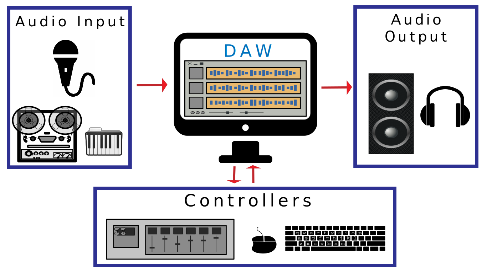

Within the modern sound studio, the DAW serves;

- as a tool for the capture digital audio to file
    - this may include audio captured on microphones or via the direct out from other analog audio devices (electric piano, tape player, or other analog audio)
- as a tool for the synthesis of audio utilizing [MIDI](https://www.midi.org), software instruments, and digital sound generators
- as a tool for the composition, arrangement, and editing of digital audio files and synthesized sounds
- as the tool for creating a mix of all of these sound such that they can all coexist with each other

# Beyond the DAW

In addition to the DAW, there is additional gear that is necessary for any studio, if the the one you are building and utilizing this semester. At the lowest level, these could be broken into three categories;

1. Input
2. Control / Mixing
3. Output

## Input

In the studio, regardless of whether this is a huge professional studio, or the work you complete this semester in your living room, inputs in the studio are the ways in which we get audio from the real world into the computer and DAW.

This includes the obvious things we have already talked about, such as microphones, outputs of electronic instruments, and the output of analog audio devices (tape machines, drum machines). This also includes equipment that we have not talked about yet, such as;

- microphone preamplifiers
- direct boxes
- analog to digital converters

For this week, we are not going to think about what it takes, or how to get, audio from the real world into the DAW. Instead, you will utilize audio that has already been converted to and captured as a digital audio file.

## Controllers and Mixers

When we start to think about working with a DAW, one aspect that becomes critical is the idea of how we will interact to edit, mix, compose, arrange, etc. To do this, studios need the ability to get various types of data and information in and out of DAW. This of course will include the use of standard computer hardware, such as;

- visual monitor
- computer mouse
- computer keyboard

For most of this semester, you will utilize these standard control mechanisms to work with your DAW.

However, controllers in the studio may also include the use of digital controllers. These digital controllers allow the producer/artist/engineer to interact with real-time data. These devices often do not have the actually ability to effect audio directly, instead they could be thought of as expensive computer mice, as they are specialized control surfaces. Some examples include;

- a MIDI piano-style keyboard
- finger-pads
- virtual mixing boards

Finally, in the mixing stage, a producer/artist/engineer may actually choose to route audio out of the DAW back into the real-world, so that they can process the audio, then they will send it back to the DAW. This may be done to utilize tools such as equalizers, compressors, or reverb. These types of processes can be accomplished both "in-the-box" (meaning through software fully inside the DAW) or through the use of hardware.

## Output

The last general category of the studio is output. This is where audio is sent back into the real-world. In its most practical job, this is how the producer/artist/engineer knows what is happening. Through the use of headphones or studio monitors (a fancy name for professional speakers) the artist is able to listen to what they are working on.

As with the Input category, this does require the use of some sort of digital-to-analog converter, which can take digital audio and transform it into electrical energy appropriate to drive headphones or monitors.

This section of a studio may also be where final recordings of the mix are made, utilizing hardware such as summing mixers and mastering-grade compressors. 
