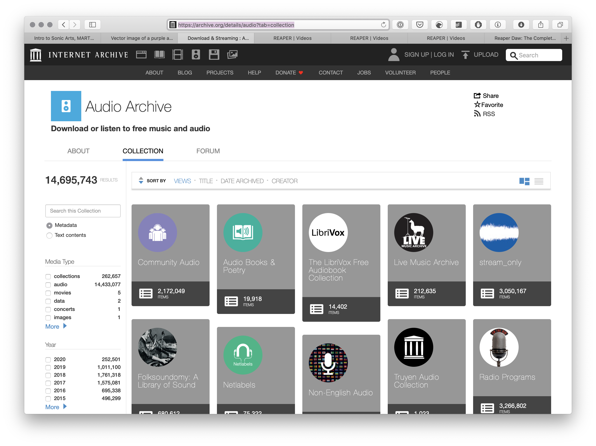
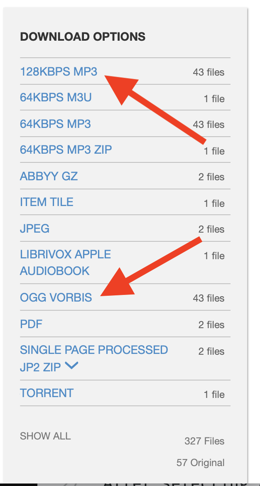
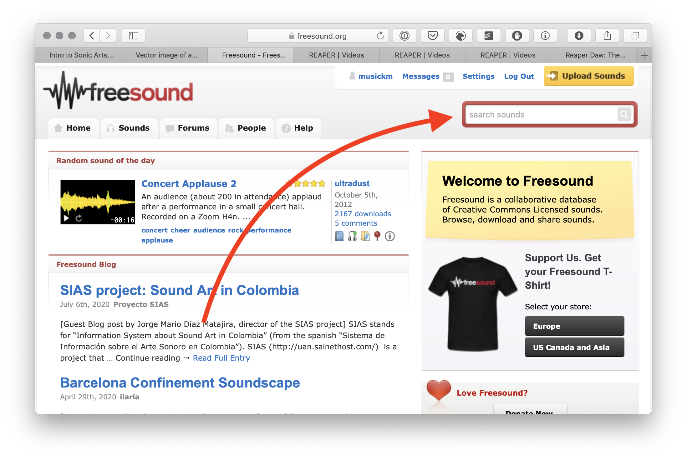

 

<iframe class="embed-responsive-item" src="https://www.youtube.com/embed/m3-LIgrh-dc" frameborder="0" allow="accelerometer; autoplay; encrypted-media; gyroscope; picture-in-picture" allowfullscreen></iframe>

Since we are not using input devices initially, we will need to utilize pre-recorded digital audio files. For this week, I want you to download two or three files from the internet to play with.

There are two great resources, which you should be aware of, where you can get digital audio files with permissions that allow you to play, alter, share, mangle, etc. the audio.

## The Internet Archive

[The Internet Archive (archive.org)](https://archive.org/) is a non-profit working to build a "digital library of Internet sites and other cultural artifacts in digital form. Like a paper library, [they] provide free access to researchers, historians, scholars, the print disabled, and the general public. [There] mission is to provide Universal Access to All Knowledge."

This project grew from the "Wayback Machine", which was a database that aimed to catalogue and document websites, over time, on the entirety of the internet. They have grown to also include books, video, audio, software, and images. Much of the material and content that they collect and provide access to is public domain, so you are free to use this in anyway you see fit. _**{ NOTE: }** Not everything on archive.org is public domain, so just check license and permissions when contemplating the use of material/content for public or commercial release._

To view music on archive.org, go to;

- [archive.org/details/audio](https://archive.org/details/audio?tab=collection)

There you can browse, search, listen, and explore.

After selecting an item, you should be able to preview the audio using the built-in web player. If you scroll down the page, there will be _Usage_ details, as well as download options. The following example of ["The Adventures of Huckleberry Finn"](https://archive.org/details/huck_finn_librivox) demonstrate that this item is in the "Public Domain".

Under the download options on the right, I am going to select the "OGG VORBIS" option and follow download procedures for macOS.

> We have not talked about digital audio file formats yet. So, I do not expect you to know what type to download, and for the time being, we can get away with not worrying to much. I would suggest you try download the following file types, in the following order;
>
> - WAV
> - AIFF
> - FLAC
> - OGG Vorbis
> - VBR
> - MP3 (higher kBPS numbers preferred)

> **{ NOTE: }** When downloading audio files, I would download them to the same directory/folder, somewhere on your computer, so that they are easily located. I would encourage you to create a dedicated audio samples directory (as opposed to your general downloads/ directory), or even to create a weekly audio downloads folder for individual projects within this class.

## freesound

Another wonderful resource for finding digital audio files is [freesound - freesound.org](https://freesound.org). This site is a collection of user created, curated, and uploaded sound files. Almost all of the sounds on this site contain licenses or permissions that allow for you to use them freely (or with minimal attribution) in your projects.

You will need to create an account to utilize freesound, but this is likely a site you will come back to countless times this semester and beyond.

There is a search box near the top-right of freesounds homepage.

You can preview sounds on the freesound site by clicking the "play" button.

If you select a sound, it will take you to the sound's individual and specific page, there you can check permissions and licensure. Likewise, if you are logged in, you will have the option of downloading the sound file.

## Library of Congress

> [**About the Library**](https://www.loc.gov/about/)
>
> The Library of Congress is the largest library in the world, with millions of books, recordings, photographs, newspapers, maps and manuscripts in its collections. The Library is the main research arm of the U.S. Congress and the home of the U.S. Copyright Office.
>
> The Library preserves and provides access to a rich, diverse and enduring source of knowledge to inform, inspire and engage you in your intellectual and creative endeavors.

The [Library of Congress](https://www.loc.gov/) has been working to digitize as much of its collection as is possible. With new resources constantly becoming available.

Many of the available collection is in the Public Domain, which allows you to use it as you wish. (_Please always check copyright status of any work you want to reuse in something that will be presented publicly_)

This collection, at the time of this writing, the [full collection contains](https://www.loc.gov/about/general-information/#year-at-a-glance) 4.2 million audio related materials and 1.9 million moving image materials.

In the ever increasing digital collection, there are currently 29,032 audio items and 9,191 video items available online.

- [Audio - Library of Congress](https://www.loc.gov/audio/)
- [Film & Video - Library of Congress](https://www.loc.gov/film-and-videos/)

## NASA Sounds

NASA has also recently worked to upload sounds from their extensive collection to the Internet. These are also a place where you may want to explore for possible sound files to use.

- [NASA - Audio](https://www.nasa.gov/connect/sounds/index.html)

## **_{ TODO: }_**

Please preview, select, and download at least three sound files from:

- [freesound](https://freesound.org)
- [The Internet Archive](https://archive.org/)
- [Audio - Library of Congress](https://www.loc.gov/audio/)
- [Film & Video - Library of Congress](https://www.loc.gov/film-and-videos/)
- [NASA](https://www.nasa.gov/connect/sounds/index.html).
