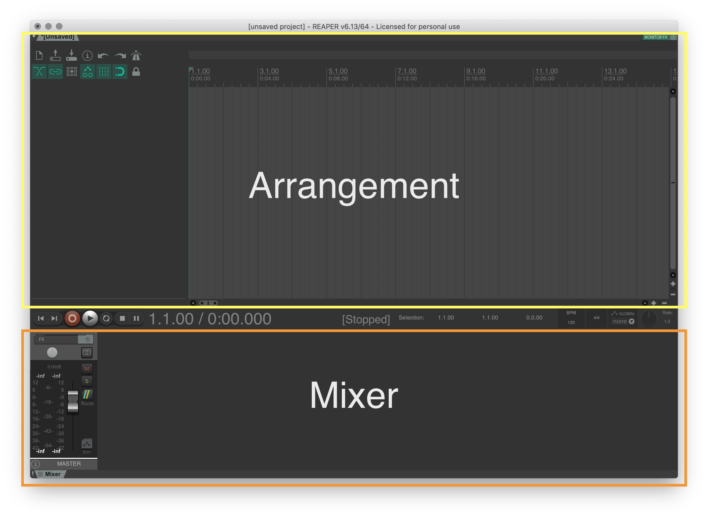
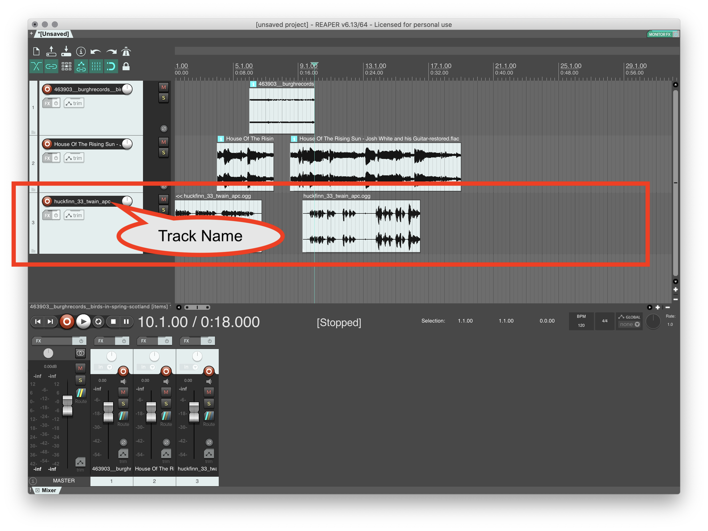
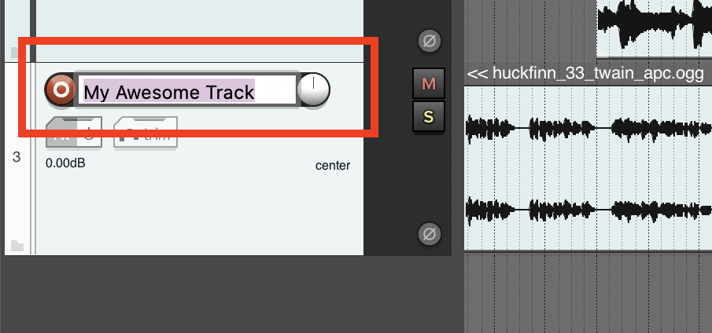
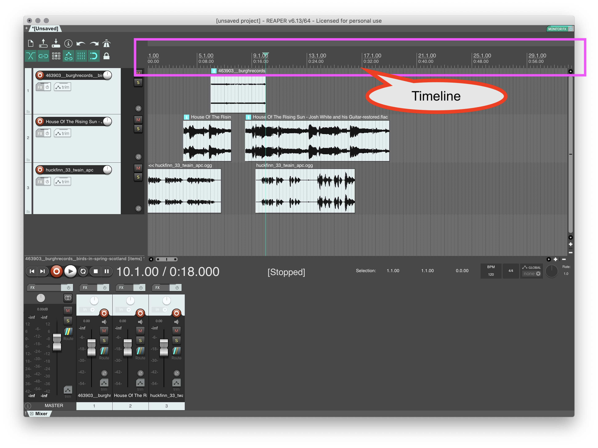
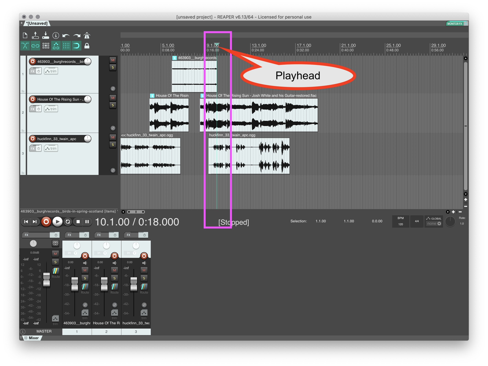
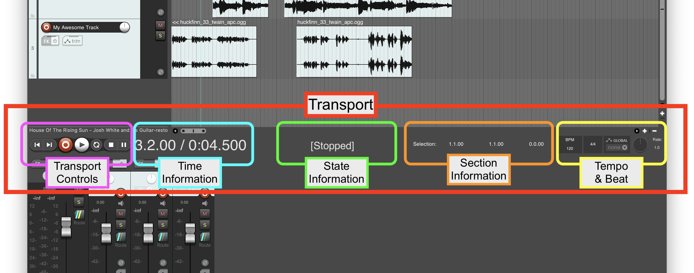

 

<iframe class="embed-responsive-item" src="https://www.youtube.com/embed/IcSTeSzO3og" frameborder="0" allow="accelerometer; autoplay; encrypted-media; gyroscope; picture-in-picture" allowfullscreen></iframe>

 

Armed with a few digital audio files to use, and Reaper successfully installed, you are ready to start working in and learning about DAWs.

 

> **{ NOTE: }** As you learn about Reaper, please remember that Reaper is one of many possible DAWs that you may use in your work and career with sonic art and sound. I will present topics and information, whenever possible, in a way that is transferrable to any other DAW. Said another way, the things you are learning should be transferrable to other DAWs, many of the concepts, terminology, and approaches are the same, especially as they all come out of the Tape-Studio tradition presented a few screens back.

# Main Views

For most DAWs, we will refer to the collection of audio, MIDI, video, and other data as a _"Session"_ or _"Project"_. Reaper uses the _"Project"_ terminology. When we open a new Project in Reaper, by default we should see two main sections (each comprised of smaller sub-sections). These are the _Arrangement View_ and _Mixer View_.

# Arrangement View

The Arrangement View, in all DAWs, will contain available tracks, almost always organized horizontally, so that data/media within those tracks can be represented horizontally in relation to each other and a master timeline.

## Adding an Audio File

To get started, let's drag a one of the audio files you downloaded, from a finder window (regardless of macOS or Windows) to the Reaper arrangement view.

## Track in Arrangement View

Now, you can see more details about this view. First, the horizontal unit created is a _"track"_ in Reaper. Tracks in DAWs are similar to individual tracks on an analog tape. They contain unique audio, where the audio file is located in relation to time.

Each audio file (or audio file segment) is represented as a block in the arrangement view, within the unique track.

## Track Name

Track names are located in a text box within the "track information section" of the arrangement view.

You can rename a track by double-clicking, or right-clicking (control+click) on the name. You should always rename your tracks. Name your tracks with explicit reference to what they are or are doing. This will help you stay organized as your sonic art projects grow larger in Reaper.

## Timeline

The _timeline_ in the arrangement view runs across the top of the view. This provides time-based information, allowing you to see where audio file segments began, end, and their length. This time information can be displayed as minute:second, bars | beats, timecode, or samples.

## Playhead

The vertical line, with a triangle on top is the _"playhead"_. The playhead is where audio will start playing from, if you select "play" or "record".

# Transport

In addition to the _Arrangement View_ and _Mixer_, another crucial section in any DAW is the _"Transport"_. The transport typically contains the following information and controls;

- Time information
    - Where is the playhead
    - If a selection has been made,
	    - Where does the selection begin and end
- Transport controls, including;
	- Play button (begins playing at the play head)
	- Record (Begin recording)
	- Move to start of Project
	- Move to end of Project
	- Loop
	- Stop
	- and Pause
- State Information
	- Is Reaper, "playing", "recording", "stopped", etc.
- Section Information
- Tempo and Beat Information

