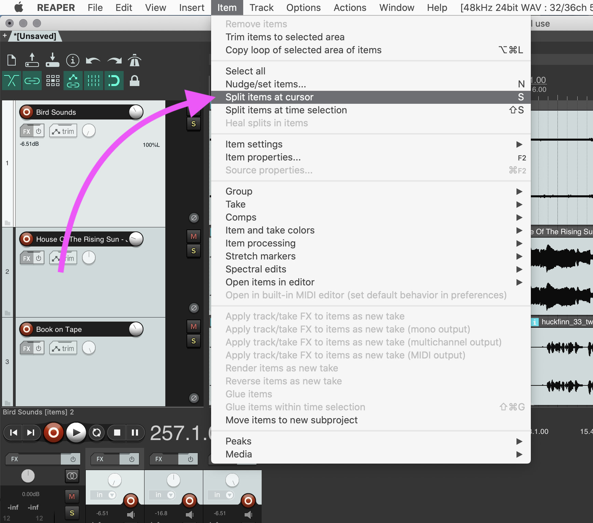
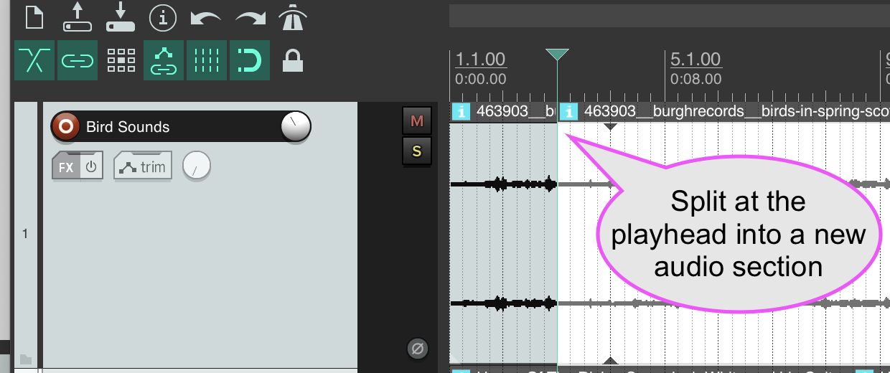
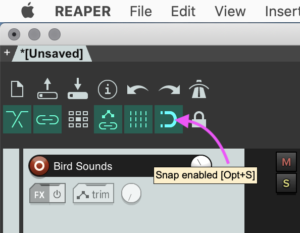

In addition to basic mixing techniques afforded by the mixer, you also need a few basic editing techniques. Particularly, you need to also be able to split and splice audio. This allows you to only pick the portion of audio that you want.

## Split

_"Splitting"_ an audio file separates everything before the split point from after into a new audio section. Once you split an audio file into multiple sections you can move them independently of each other, delete part of the audio file, or edit together the best parts of an audio file.

To split an audio file, place the playhead at the location you want to split by clicking at that point in the audio section you want to split. Then either select "Split Item at Cursor" from the "Item" menu, or press the 's' key.

In the following two images, you can see how after splitting the audio at the playhead, there is now a new audio section label (the blue "i"), a line between the sections is also now present.

Now, if you click in the section, you can then drag it around, or hit the "delete" key to remove it.

## Move an Audio Section

To move an audio section, click in the section, so that it is highlighted, then move it left or right by pointing-and-dragging.

> **{ NOTE: }** Notice right now that if you move an item, it "snaps" to the visible grid. If you like this behavior, then great. But if you want the ability to precisely place an audio section on the arrangement view, then you need to turn off snapping. This is accomplished by pressing the "magnet" looking button so it is "de-selected".
>
> 
