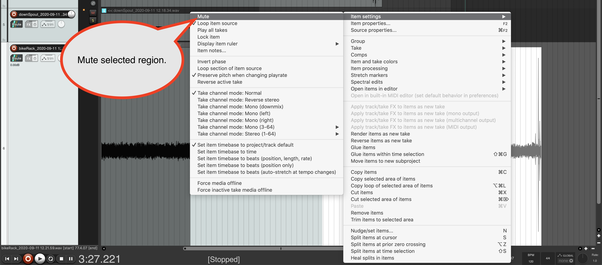
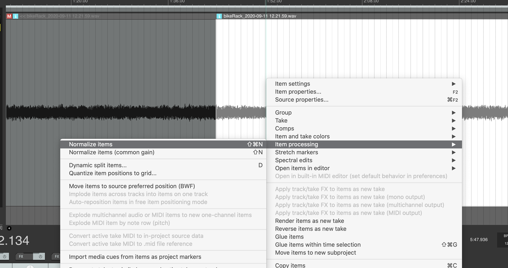
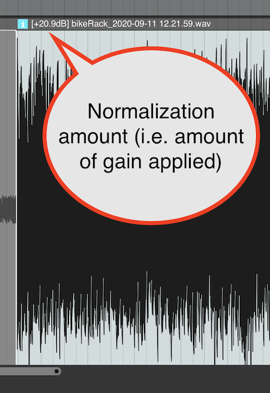
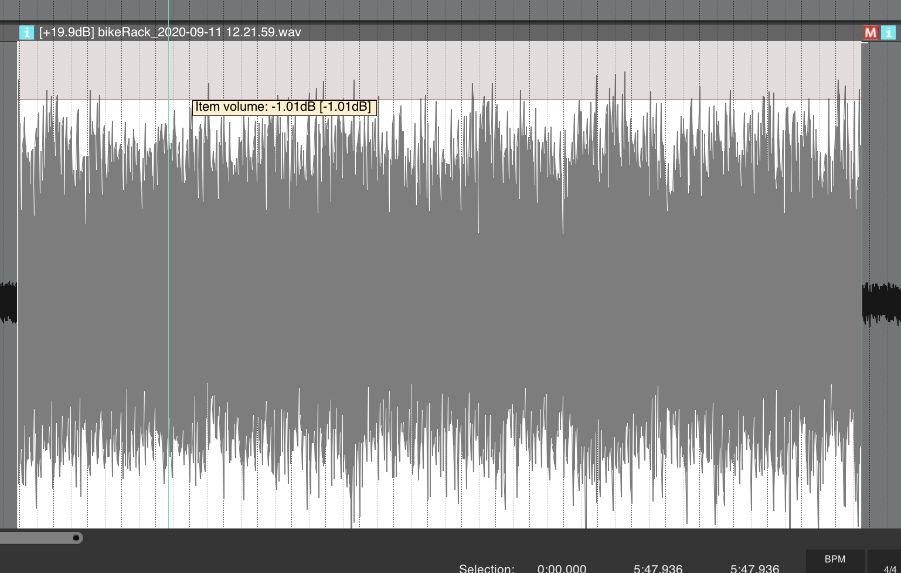
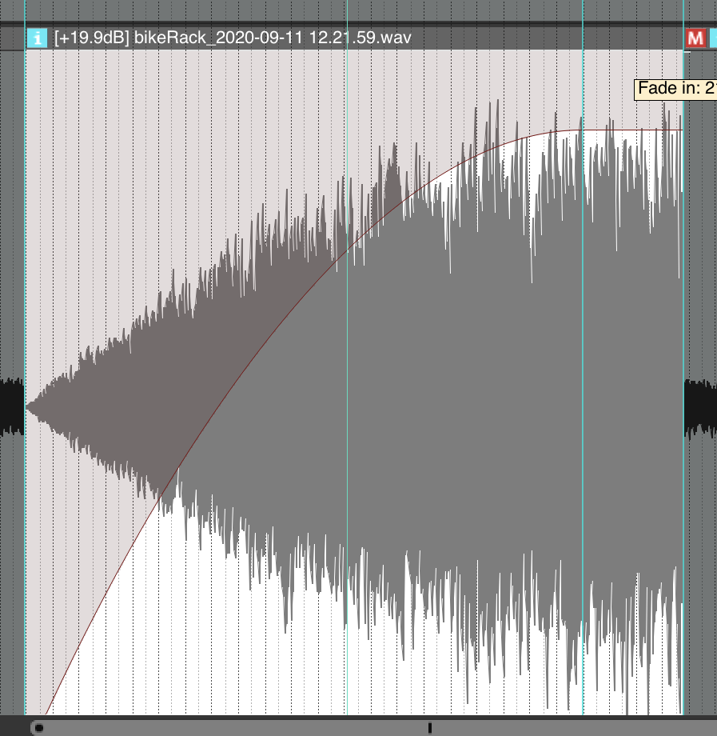
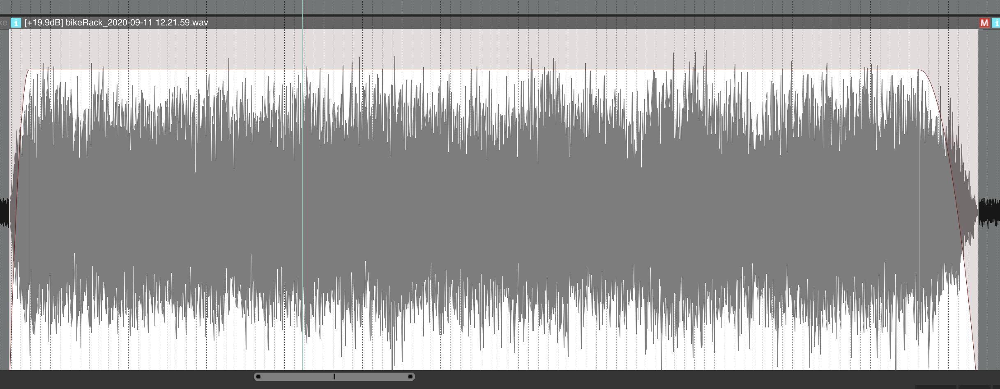
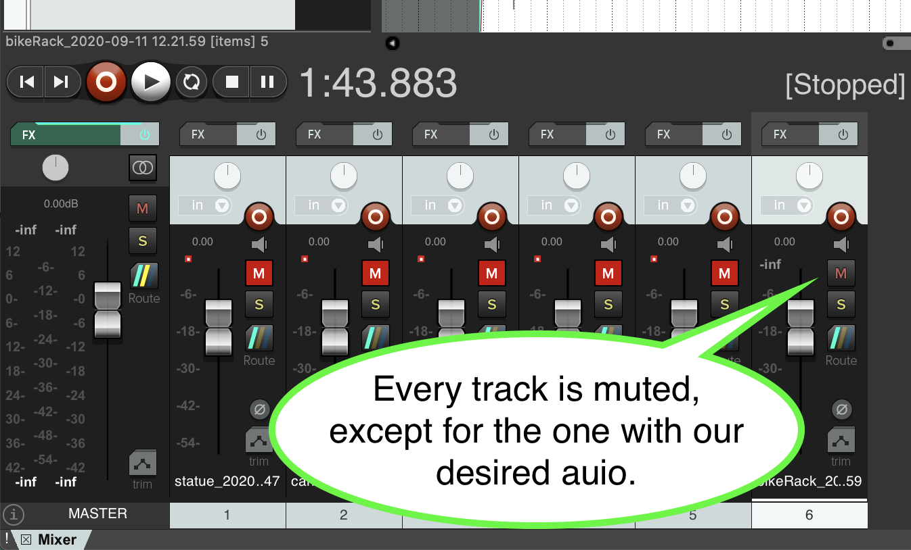
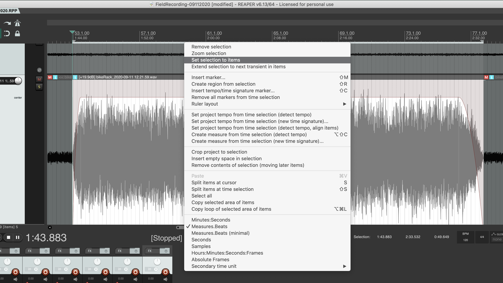
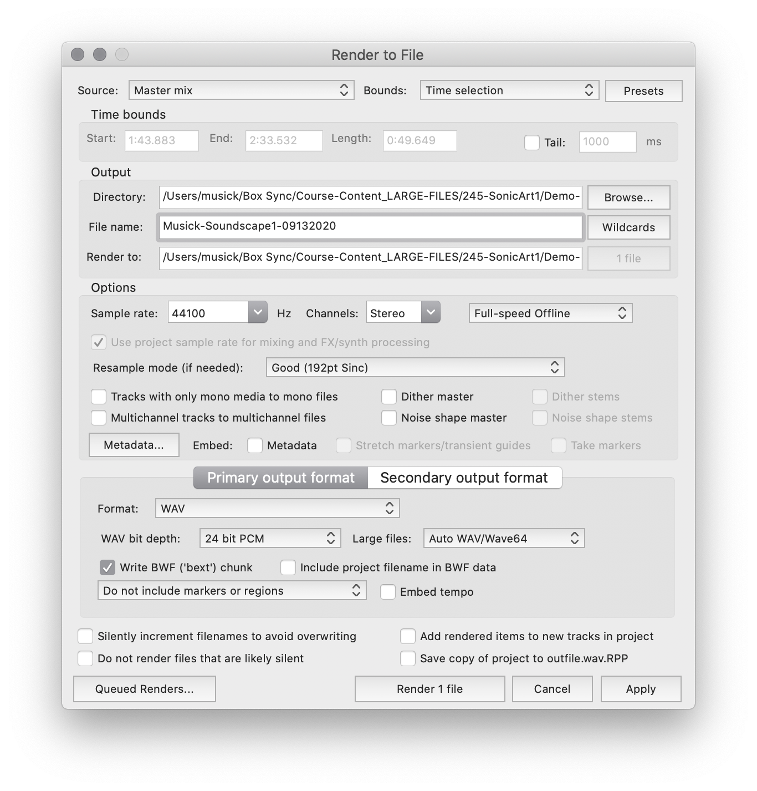

 

<iframe class="embed-responsive-item" src="https://www.youtube.com/embed/_e-yz1XBPlk" frameborder="0" allow="accelerometer; autoplay; encrypted-media; gyroscope; picture-in-picture" allowfullscreen></iframe>

There are a few techniques that will help you in your work this week.

## Save Project and Store New Media to "Media" Directory

When we open Reaper, the first thing to do is Create a "New Project". This will be necessary if Reaper reopened a previously open session. You can create a new project under the main File Menu.

After creating a new project, before we do ANYTHING ELSE, we should save the project. When you save your project remember to do the following;

1. Select a parent directory where all of your sonic art projects are being stored. (_Hopefully in a cloud-based storage location_).
2. Label it something meaningful (this week might be `FieldRecordings1`)
3. Append the date of the project after the name (for me this might result in: `FieldRecordings1-09112020`)
4. Ensure that "Create subdirectory for project" is selected.

After saving your project, I want you to also ensure the following (which you should do with each new Reaper project)

1. Open Project Settings (This is accessed under the main File menu).
2. Navigate to the "Media" tab
3. Add a relative "Media" directory, this is where all added, or recorded media will be placed, relative to your project directory path.
4. Change "On import of media to project:" to "Copy Media to Project Path".
5. Insure that WAV, is the file type for new recordings.
6. Set "WAV bit depth: " to "32 bit FP"
7. Finally, press "Save as default project settings"

You are now ready to drag in your audio, and begin chosing your selections for this week.

## Reminder on Splicing

After you import your audio, you will need to audition your captures to pick the desired selections, After identifying the selections, you will need to splice them to create smaller audio items/regions.

To splice audio, place the selection marker where you want to separate your audio file. Then press the 'S' key. This will splice your file at that point.

## Mute Unused Audio

For this assignment, I would encourage you to mute any unused audio (i.e. audio sections before and after your chosen 60-90 second section). This way, you can keep the audio around, in case you decide you want it later. Likewise, there will be lots of times while working in a DAW, where you may not want to delete audio regions, so that you can continue to have access to them, but where you want them muted.

1. To mute an audio region in Reaper, select the region by clicking in it.
2. Then right-click the region, under the "Item Settings" sub-menu, select the "Mute" option. (You can also press "option+m" [mac] or "alt+m" [win])

Muted audio items/regions will be "greyed" out, and have an "m" in the top-right of the audio item/region.

## Normalize Audio

I also want you to normalize your audio. _Normalizing_ is where we analyze an entire audio region in order to find the single 'loudest' sample or moment in the region. Normalizing determines the difference between this sample and some set level. By default, this set level is 0dBFS. The process then determines how much gain to add to the sample to make it equivalent to 0dBFS. The _ENTIRE_ region is then multiplied by this same factor, thereby raising the gain or amplitude of the entire region by that amount.

> **0dbFS** stands for "zero decibels full scale". In a digital system, that is as loud as any sample can be represented by the digital data. In other words, no sample can be represented as louder. Everything below **0dBFS** (i.e. -3dBFS or -12dBFS), references how much dynamic room there is between that moment and the loudest possible representation.
>
> This concept is confusing. By normalizing your audio to some level (whether 0dBFS or -3dBFS), you are not necessarily making your audio region (or track) "sound louder". Instead, you are multiplying every moment by the same amount. Thereby reducing the amount of room between the loudest moment, and loudest possible representation. But also thereby increasing the difference between the softest moment and the softest possible representation.
>
> Furthermore, how loud something is played is entirely reliant on the analog components that audio is eventually played through. The user of these components can change the loudness by effecting the gain of the audio system.
>
> There are times when we want to normalize our audio to adjust the level of the entire sample. In this case, we want to normalize to -1dBFS. By doing so, we are making it so that you do not have to turn your analog audio gain up AS MUCH.
>
> However, even after we normalize, you may notice that your resulting audio does not sound AS LOUD as "professionally produced" music tracks. That is because these tracks are altering the average perceived "loudness" of a track. This average perceived loudness is what makes something seem loud or soft, relatively. We will learn more about this later.

We will normalize as follows (this will change later in the semester).

#### 1. Initial Normalization

Either select "Normalize Items" to normalize a selected region by right-clicking, and selecting it from the "Item Processing" sub-menu. 

Alternatively, if you press the "i" at the top right of a region, you can bring up the "item properties" window. There you can press the "normalize button" half way down the window. 

#### 2. Gain Amount Applied

Your audio will now be normalized to 0dBFS. You should see how much the gain of the item/region was raised represented in the top-left of the item/region. (Note, in some instances, you will also visually be able to see that amplitude gain was applied to the item/region, as the peaks will be higher.) 

#### 3. Reduce Peak to -1.0dBFS

Finally, move your mouse to the top of the audio item/region until you see double-arrow icon as your mouse pointer (it should look like to vertical arrows with a horizontal line). You can then drag click and drag the item gain down to -1.0 dBFS.

## Fades

The final thing we are going to do is add a fade-in and fade-out to our audio. A _fade_, as the term implies, fades the volume, and resulting gain-over-time of an item/region from infinity (i.e. no audible sound, written as `-inf`, and said as "negative infinity") or fades an item/region to infinity. The following image demonstrates how the audio amplitude is multiplied smoothly over time, from infinity to the desired amplitiude.

#### Add a Fade With Your Mouse

To easily add a fade-in in Reaper (or conversely, fade-out), move your mouse near the left-upper-most corner of an audio item/region. You will see your mouse pointer change to a fade-in (or fade-out) icon.

Once you see the fade-mouse-pointer-icon, you can click and drag to the desired length.

**{ NOTE: }** For fade-in, I would suggest between 0.25 and 3 seconds. For fade-out, I would suggest between 1 and 5 seconds. For this assignment specifically.

After applying a fade-in/out, you should listen to it, and adjust the length based on what you determine the appropriate length should be.

#### Add a Fade With Item Properties Window

You can also add a fade-in/out by setting their length in the item properties window. To open the item properties window (again), press the "i" in the top-left corner of the audio item/region, you can also right click and select "item properties" from the item/region menu, or select a region with your mouse and press `f2`.

In the top-right corner of this window is the fade properties. You can type in the length of fade-in/out you want, press "apply" or "OK" down below, audition, and then adjust as necessary.

The resulting audio item, with normalization to -1.0dBFS and fades applied should look like the following;

## Reminder on Exporting

To export your resulting soundscape or field recording;

#### 1. Mute Everything Else

First, in case you have other tracks from your field recording captures, mute everything that is not the track in question.

#### 2. Set Selection to Audio Item

Next, we want to set our selection to the desired audio item/region. To do this, select the desired audio region, by clicking it with your mouse. (This will cause it to be highlighted)

Then, right click the horizontal selection timeline in the arrangement window, and select "Set selection to items". This will cause the arrangement selection to mirror the item selection.

#### 3. Bounce

Finally, select "Render" from the main "File" menu.

1. When the Render window pops up, select "Time Selection" under the "Bounds" menu.
2. Change the directory to be an "Export" directory (you may need to make one) inside your project directory.
3. Name the file "YourLastName-soundscape#-MMDDYYYY"
4. Set sample rate to 44100 Hz
5. Set channels to "Stereo"
6. Finally click "Render 1 file"

