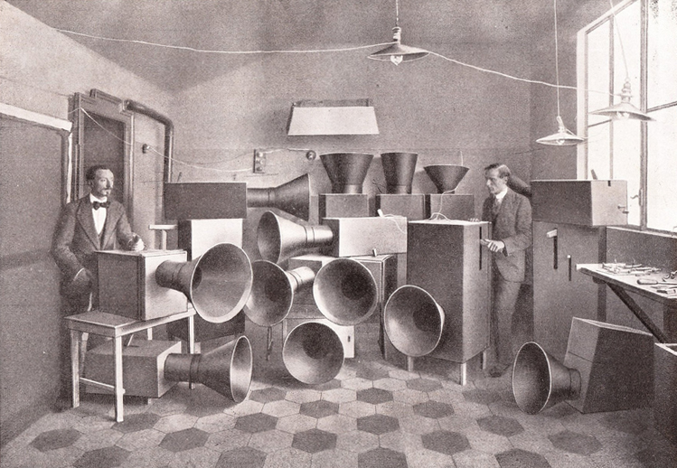
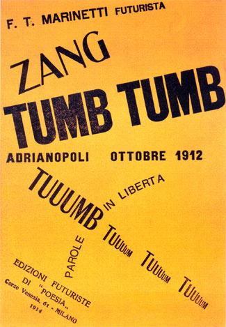

 

Now that we have more clarity about what _sonic art_ entails, and have studied the critically important field of _soundscape_ I want to talk about the Italian Futurists.

## Manifesto of Futurism

In the content over the last few weeks, you have read about some references to the Italian Futurists. I will leave the bulk of your learning about this movement to your art history classes. However, I do want you to read the original _Manifesto of Futurism_ by Filippo Tommaso Marinetti.

**_{ TODO: }_** Please read the following:

- [The Founding and Manifesto of Futurism  – Italian Futurism](https://www.italianfuturism.org/manifestos/foundingmanifesto/)

_The below is a reading of excerpts from the manifesto. Available from the [MoMA Website](https://www.moma.org/multimedia/video/76/453)_

<iframe class="embed-responsive-item" src="https://assets.moma.org/momaorg/shared/video_file/video_file/462/futurist_manifesto-h.264_youtube_640_480.mp4" frameborder="0" allow="accelerometer; autoplay; encrypted-media; gyroscope; picture-in-picture" allowfullscreen></iframe>

## The Art of Noises

The are two important works that emerged from this movement and helped lay the ground for _sonic art_. The first, is Luigi Russolo's "The Art of Noises" Manifesto.

**_{ TODO: }_** Please read the following article from History Today on Russolo's piece.

- [Lee, Alexander. “The Art of Noises: As the sounds of the world rattled into the future, so, too, did art and music.” _History Today_, Volume 67 Issue 12, 2017. Available from: https://www.historytoday.com/archive/music-time/art-noises](https://www.historytoday.com/archive/music-time/art-noises)

 

Although the Futurists were fascinated with machines and the sounds of humanity, their approach shares similar aesthetics to the ideals of soundscape. This is particularly true in that they wanted to focus on the quality of a sound, instead of its relationships according to notions of pitch or harmony. Likewise, as with soundscape, they were focused on the idea that the sounds of _our world_ are enough.

**_{ TODO: }_** Armed with this basic perspective on Russolo, please now read his "Art of Noises".

- Russolo, Luigi. "The Art of Noise (futurist manifesto, 1913)". Translated by Robert Filliou.
	- [U B U W E B :: Luigi Russolo - The Art of Noises](https://www.ubu.com/papers/russolo.html)
		- Web-Based Version
	- [A Great Bear Pamphlet - The Art of Noises](https://github.com/Montana-Media-Arts/intro-to-sonic-arts/raw/master/resources/russolo_noise.pdf)
		- PDF Version

 

Unfortunately, none of Russolo's instruments survived the World Wars. As such, we are only left to approximate what it might have sounded like. We do have the following image of Russolo and his _Intonarumori_ or "noise orchestra" of sound makers, which gives some idea of what they would have been like.

Approximations of this work have created examples of how Russolo's orchestra _may have sounded_.

<iframe class="embed-responsive-item" src="https://www.youtube.com/embed/Lqej96ZVoo8" frameborder="0" allow="accelerometer; autoplay; encrypted-media; gyroscope; picture-in-picture" allowfullscreen></iframe>


Add in information about Filippo Tommaso Marinetti's futurist sound poem "Zang Tumb Tumb"
https://www.youtube.com/watch?v=u1Yld7wGWEI


## Futurist Sound Poems

The other great work to come out of the Italian Futurists was also presented in excerpt (a small piece of it) in Russolo's Manifesto, and that is F.T. Marinetti's own _sound poem_ "Zang Tumb Tumb".

> every 5 seconds siege cannons gutting space with a chord ZANG-TUMB-TUUMB mutiny of 500 echos smashing scattering it to infinity. In the center of this hateful ZANG-TUMB-TUUMB area 50square kilometers leaping bursts lacerations fists rapid fire batteries. Violence ferocity regularity this deep bass scanning the strange shrill frantic crowds of the battle Fury breathless ears eyes nostrils open! load! fire! what a joy to hear to smell completely taratatata of the machine guns screaming a breathless under the stings slaps traak-traak whips pic-pac-pum-tumb weirdness leaps 200 meters range Far far in back of the orchestra pools muddying huffing goaded oxen wagons pluff-plaff horse action flic flac zing zing shaaack laughing whinnies the tiiinkling jiiingling tramping 3 Bulgarian battalions marching croooc-craaac [slowly] Shumi Maritza or Karvavena ZANG-TUMB-TUUUMB toc-toc-toc-toc [fast] crooc-craac [slowly] crys of officers slamming about like brass plates pan here paak there BUUUM ching chaak [very fast] cha-cha-cha-cha-chaak down there up around high up look out your head beautiful! Flashing flashing flashing flashing flashing flashing footlights of the forts down there behind that smoke Shukri Pasha communicates by phone with 27 forts in Turkish in German Allo! Ibrahim! Rudolf! allo! allo! actors parts echos of prompters scenery of smoke forests applause odor of hay mud dung I no longer feel my frozen feet odor of gunsmoke odor of rot Tympani flutes clarinets everywhere low high birds chirping blessed shadows cheep-cheep-cheep green breezes flocks don-dan-don-din-baaah Orchestra madmen pommel the performers they terribly beaten playing Great din not erasing clearing up cutting off slighter noises very small scraps of echos in the theater area 300 square kilometers Rivers Maritza Tungia stretched out Rodolpi Mountains rearing heights loges boxes 2000 shrapnels waving arms exploding very white handkerchiefs full of gold srrrr-TUMB-TUMB 2000 raised grenades tearing out bursts of very black hair ZANG-srrrr-TUMB-ZANG-TUMB-TUUMB the orchestra of the noises of war swelling under a held note of silence in the high sky round golden balloon that observes the firing...

This work is significant for its use of onamonapia type words, mimicking the sounds of war. This work also utilized typography that suggested how to read or recite the work, adding to its raw qualities.

An excerpt of this poem can be experienced below. Notice how the film-maker mimics the typography used by Marinetti.

<iframe class="embed-responsive-item" src="https://www.youtube.com/embed/3_3O0zOiX-w" frameborder="0" allow="accelerometer; autoplay; encrypted-media; gyroscope; picture-in-picture" allowfullscreen></iframe>

 

If you desire, you can read more futurist poems from the following anthology via monoskop:

- [https://monoskop.org/images/c/c4/Bohn_Willard_ed_Italian_Futurist_Poetry_2005.pdf](https://monoskop.org/images/c/c4/Bohn_Willard_ed_Italian_Futurist_Poetry_2005.pdf)

## Move Away from the Institution

As you can gather, the work by the Italian Futurists represented a significant move away from the academic and museum institutions. This moment is one that assisted in freeing artists from the confines of the conservatory-style rules and systems. Likewise, the use of sound as art can be credited as early example of _sound art_.

<h4>References and Resources</h4>

The above content was adapted from:

<ol>
<li><a href="https://architectofsound.wordpress.com/2016/06/20/the-art-of-noises-a-futurist-manifesto-by-luigi-russolo/">The Art of Noises: A Futurist Manifesto by Luigi Russolo and it’s influence on the 21st Century. Available from; https://architectofsound.wordpress.com/2016/06/20/the-art-of-noises-a-futurist-manifesto-by-luigi-russolo/.</a></li>
</ol>

